## 1、nacos2 安装

### nacos简介

​      Nacos 致力于帮助您发现、配置和管理微服务。Nacos 提供了一组简单易用的特性集，帮助您快速 实现动态服务发现、服务配置、服务元数据及流量管理。 

​	简要介绍，Nacos就是为微服务提供服务注册中心，和服务配置管理服务的系统。Nacos详细内容请[参考官网文档](https://nacos.io/zh-cn/docs/what-is-nacos.html) .

​	本文主要面向 [Spring Cloud](https://spring.io/projects/spring-cloud) 的使用者，通过示例来介绍如何使用 Nacos 来实现微服务的配置管理和服务注册发现。这里为了开发测试方便，选择的安装环境是windows，数据库采用mysql，以单机模式启动。 


### 1.1 下载安装包

  从https://github.com/alibaba/nacos/releases 选择下载最新版，这里选择的是[nacos-server-2.0.4.zip](https://github.com/alibaba/nacos/releases/download/2.0.4/nacos-server-2.0.4.zip)

  下载后解压到某盘位置。同时创建mysql数据库，这里创建的数据库名为nacos204。

   并从conf目录下找到nacos-mysql.sql文件，在mysql客户端选择创建的nacos204数据库，执行nacos-mysql.sql脚本。创建nacos数据库表。

### 1.2 修改配置

在安装目录下找到conf目录的application.properties文件，修改配置项，修改内容如下：

```
#*************** Config Module Related Configurations ***************#
### If use MySQL as datasource:
spring.datasource.platform=mysql

### Count of DB:
db.num=1

### Connect URL of DB:
db.url.0=jdbc:mysql://127.0.0.1:3306/nacos204?characterEncoding=utf8&connectTimeout=1000&socketTimeout=3000&autoReconnect=true&useUnicode=true&useSSL=false&serverTimezone=UTC
db.user.0=root
db.password.0=root
```

到安装目录bin目录下，找到startup.cmd进行修改，修改内容：

```
#原来内容
#set MODE="cluster" 
#修改后内容
set MODE="standalone"
```

### 1.3 启动服务

​     运行startup.cmd ，出现类似下面内容，启动成功：

```
"nacos is starting with standalone"
         ,--.
       ,--.'|
   ,--,:  : |                                           Nacos 2.0.4
,`--.'`|  ' :                       ,---.               Running in stand alone mode, All function modules
|   :  :  | |                      '   ,'\   .--.--.    Port: 8848
:   |   \ | :  ,--.--.     ,---.  /   /   | /  /    '   Pid: 15248
|   : '  '; | /       \   /     \.   ; ,. :|  :  /`./   Console: http://192.168.207.1:8848/nacos/index.html
'   ' ;.    ;.--.  .-. | /    / ''   | |: :|  :  ;_
|   | | \   | \__\/: . ..    ' / '   | .; : \  \    `.      https://nacos.io
'   : |  ; .' ," .--.; |'   ; :__|   :    |  `----.   \
|   | '`--'  /  /  ,.  |'   | '.'|\   \  /  /  /`--'  /
'   : |     ;  :   .'   \   :    : `----'  '--'.     /
;   |.'     |  ,     .-./\   \  /            `--'---'
'---'        `--`---'     `----'

2022-03-16 20:17:28,183 INFO Bean 'org.springframework.security.access.expression.method.DefaultMethodSecurityExpressionHandler@5aa0dbf4' of type [org.springframework.security.access.expression.method.DefaultMethodSecurityExpressionHandler] is not eligible for getting processed by all BeanPostProcessors (for example: not eligible for auto-proxying)
。。。。。。。。
2022-03-16 20:17:36,502 INFO Tomcat started on port(s): 8848 (http) with context path '/nacos'
2022-03-16 20:17:36,506 INFO Nacos started successfully in stand alone mode. use external storage
```

### 1.4 访问测试

​      打开浏览器，输入http://localhost:8848/nacos ，打开登录页，输入用户名/密码 nacos/nacos 

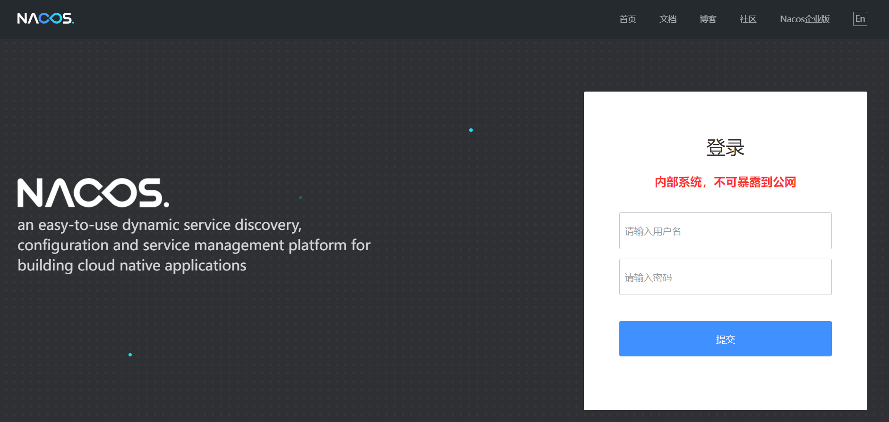

登录后界面：

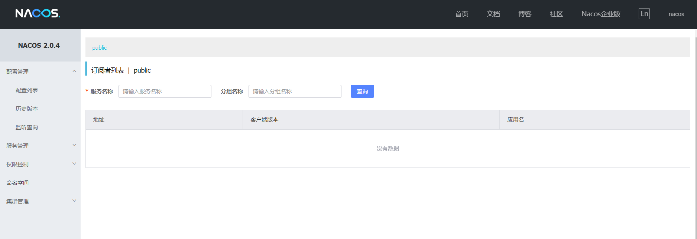


 ## 2、Nacos 配置中心

​		这里介绍使用nacos作为配置中心，将各个微服务的配置文件统一存放在nacos上，然后各个微服务从nacos上拉取配置即可。 接下来以一个微服务配置为例来学习nacos config的使用。

### 2.1 代码工程引入nacos config依赖

```
<dependency>
    <groupId>com.alibaba.cloud</groupId>
    <artifactId>spring-cloud-starter-alibaba-nacos-config</artifactId>
</dependency>
```

> 这里有一个坑，在spring cloud 工程pom.xml配置中，还要引入 spring-cloud-starter-bootstrap依赖， 否则无法从nacos配置中心拉取配置。

```
 <dependency>
    <groupId>org.springframework.cloud</groupId>
    <artifactId>spring-cloud-starter-bootstrap</artifactId>
 </dependency>
```

### 2.2 代码工程添加nacos config配置 

​      这里需要注意：不能使用原来的application.yml作为配置文件，而是新建一个bootstrap.yml作为配置文件。

> 把本地application.yml文件配置删除或注释掉，也可以改个名称以备用。

>  配置文件优先级(由高到低)： bootstrap.properties -> bootstrap.yml -> application.properties -> application.yml

这里用 bootstrap.yml，文件内容：

```
spring:
   application:
      name: javafree-cloud-admin  # 微服务名称
   cloud:
      nacos:
        config:
            server-addr: 127.0.0.1:8848 #nacos中心地址
            file-extension: yml # 配置文件格式
   profiles:
      active: dev # 环境标识
```

### 2.3 在nacos 管理中心添加配置 

​	点击配置列表，点击右边+号，新建配置。在新建配置过程中，要注意下面的细节： 

​	1）Data ID不能随便写，要跟配置文件中的对应，对应关系如图所示	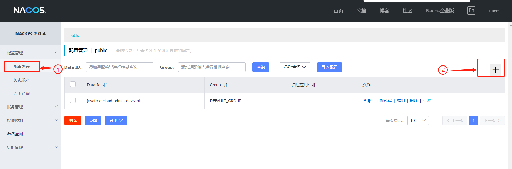

​	2）配置文件格式要跟配置文件的格式对应，且目前仅支持YAML和Properties 

​	3）配置内容按照上面选定的格式书写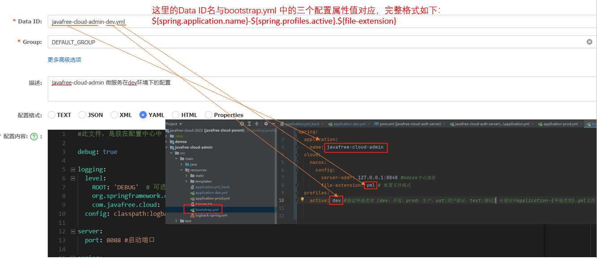

​		把原来application.yml文件的内容，放到配置中心，文件内容如下：

```
debug: false
logging:
  level:
    ROOT: 'INFO'  # 可选项 OFF > FATAL > ERROR > WARN > INFO > DEBUG > TRACE > ALL
    org.springframework.cloud: 'INFO'
    com.javafree.cloud: 'INFO'
  config: classpath:logback-spring.xml

server:
  port: 8088 #启动端口

spring:
  application:
    name: javafree-cloud-admin
    thymeleaf:
      cache: false
  datasource:
    #com.mysql.jdbc.Driver和mysql-connector-java 5用。
    driver-class-name: com.mysql.cj.jdbc.Driver
    url: jdbc:mysql://localhost:3306/javafree8?useUnicode=true&characterEncoding=utf-8&serverTimezone=Asia/Shanghai
    username: root
    password: root
    type: com.alibaba.druid.pool.DruidDataSource
    druid:
      initial-size: 5 #初始连接数
      max-active: 10 #最大活动连接
      max-wait: 60000 #从池中取连接(没有闲置连接)的最大等待时间,-1表示无限等待
      min-idle: 5 #最小闲置数,小于min-idle连接池会主动创建新的连接
      time-between-eviction-runs-millis: 60000 #清理线程启动的间隔时间,当线程池中没有可用的连接启动清理线程
      min-evictable-idle-time-millis: 300000 #清理线程保持闲置最小时间
      validation-query: SELECT 1  #用于校验连接
      test-on-borrow: false #请求连接时是否校验,比较消耗性能,一般设置false
      test-on-return: false #归还连接时是否校验,比较消耗性能,一般设置false
      test-while-idle: true #清理线程通过validation-query来校验连接是否正常,如果不正常将从连接池中移除
      pool-prepared-statements: true #存储相同逻辑的sql到连接池的缓存中
      #      filters: stat,wall #监控统计web的statement(sql),以及防sql注入的wall
      # 关闭如上配置,可以采用自定义的filter
      filter:
        stat:
          enabled: true #状态监控-->stat
          db-type: mysql
          log-slow-sql: true  #记录超过指定时间的sql到日志中
          slow-sql-millis: 2000
        wall:
          enabled: true #防火墙-->wall
          db-type: mysql
          config:
            delete-allow: true #false禁止删除
            drop-table-allow: false #禁止删除表
      web-stat-filter:
        enabled: true #开启监控uri,默认false
        url-pattern: /* #添加过滤规则
        exclusions: "*.js,*.gif,*.jpg,*.png,*.css,*.ico,/druid" #忽略过滤
      stat-view-servlet:
        enabled: true #开启视图管理界面,默认false
        url-pattern: /druid/* #视图管理界面uri
        login-username: druid #账号
        login-password: 123456 #密码
  #        allow: 127.0.0.1 白名单
  #        deny:  192.168.1.130黑名单
  jpa:
    show-sql: true # 默认false，在日志里显示执行的sql语句
    hibernate:
      ddl-auto: update #指定为update，每次启动项目检测表结构有变化的时候会新增字段，表不存在时会新建，如果指定create，则每次启动项目都会清空数据并删除表，再新建
    properties:
      hibernate:
        dialect: org.hibernate.dialect.MySQL8Dialect
        # naming_strategy: org.hibernate.cfg.ImprovedNamingStrategy
    open-in-view: off  #尽快释放数据库连接资源，不支持jpa的懒加载

  #设置jackson返回时间格式及时区
  jackson:
    date-format: yyyy-MM-dd HH:mm:ss # 日期时间格式
    time-zone: GMT+8  # 北京时区
    default-property-inclusion: non_null # 属性不为空


  cloud:
    nacos:
      discovery:
        server-addr: 127.0.0.1:8848 
# swagger配置项
springfox:
  documentation:
    enabled:  true #开发环境打开swagger功能,生产环境要关闭

```


### 2.4 Nacos 配置动态刷新

​	  上面示例中，我们实现了配置的远程存放，但是此时如果修改了配置，我们的程序是无法读取到的，因此，我们需要开启配置的动态刷新功能。 

​	在nacos中的javafree-cloud-admin-dev.yml配置项中添加下面配置:

```
test: 
   useLocalCache:  true 
```

> 注：Nacos配置动态刷新，建议只用在一些运行时开关配置项上，对于程序启动时需要的初始参数配置，应用动态刷新机制则很难。如服务启动的端口配置、数据库的连接配置等，因这些配置发生改变，是需要重新启动服务的。

**方式1：注解方式（推荐）**

 	通过 Spring Cloud 原生注解 `@RefreshScope` 实现配置自动更新

```
import org.springframework.beans.factory.annotation.Value;
import org.springframework.cloud.context.config.annotation.RefreshScope;
import org.springframework.web.bind.annotation.RequestMapping;
import org.springframework.web.bind.annotation.RestController;
 
@RestController
@RequestMapping("/test_config")
@RefreshScope
public class ConfigTestController {

  //test.useLocalCache 是在nacos配置中心配置的属性，如果取不到，默认是false
  @Value("${test.useLocalCache:false}")
  private boolean useLocalCache;

  @RequestMapping("/get")
  public boolean get() {
    return useLocalCache;
  }
}
```

启动服务后，访问test_config/get，可以看到配置的内容，当改变配置中心的内容，再访问，可以看到值会变化。

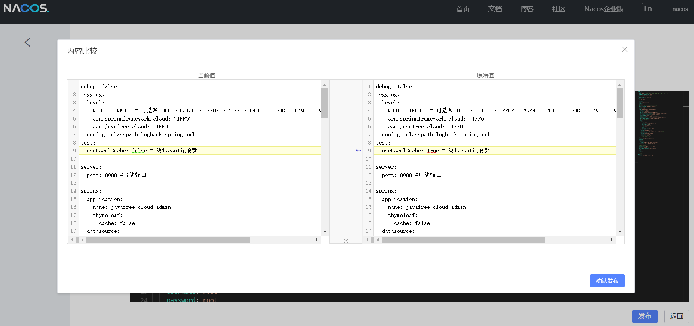

**方式2：硬编码方式**

```
import org.springframework.beans.factory.annotation.Autowired;
import org.springframework.context.ConfigurableApplicationContext;
import org.springframework.web.bind.annotation.RequestMapping;
import org.springframework.web.bind.annotation.RestController;
 
@RestController
@RequestMapping("/test2_config")
public class ConfigTest2Controller {
  @Autowired
  private ConfigurableApplicationContext applicationContext;

  @RequestMapping("/get")
  public boolean get() {
    String strVal=applicationContext.getEnvironment().getProperty("test.useLocalCache");
    boolean useLocalCache =Boolean.valueOf(strVal);
    return useLocalCache;
  }
}

```

### 2.5 Nacos 配置共享

​		当配置越来越多的时候，我们就发现有很多配置项内容是重复的，这时候就要考虑将公共配置提取出来，放到一个公共配置文件里供众多服务共享。

​	配置共享可以分为两类情况：同一个微服务不同环境之间的共享配置、不同微服务之间的共享配置。下面先说同一个微服务的不同环境之间共享配置。

 	如果想在同一个微服务的不同环境之间实现配置共享，其实很简单。 只需要提取一个以 spring.application.name 命名的配置文件，然后将其所有环境的公共配置放在文件里面即可。其实集成了nacos配置中心的微服务，在启动时，首先都会去Nacos配置中心找以spring.application.name 命名+{file-extension}的配置文件。

#### A. 同一个微服务不同环境之间的共享配置

**1. 新建一个名为javafree-cloud-admin.yml配置存放这个微服务的公共配置**

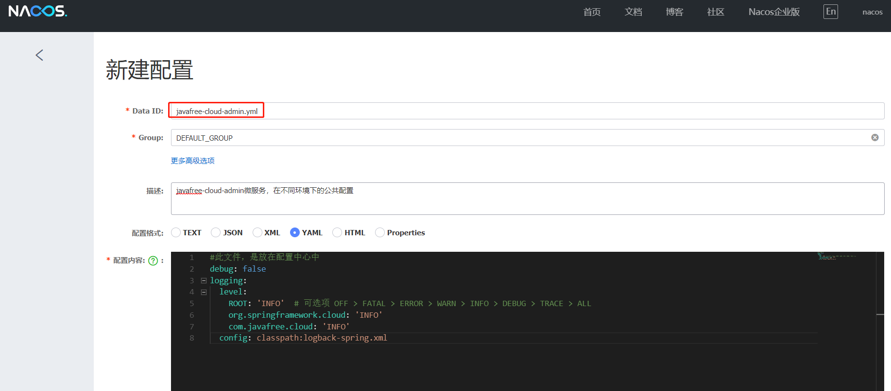

**2. 新建一个名为javafree-cloud-admin-dev.yml配置存放开发环境配置**

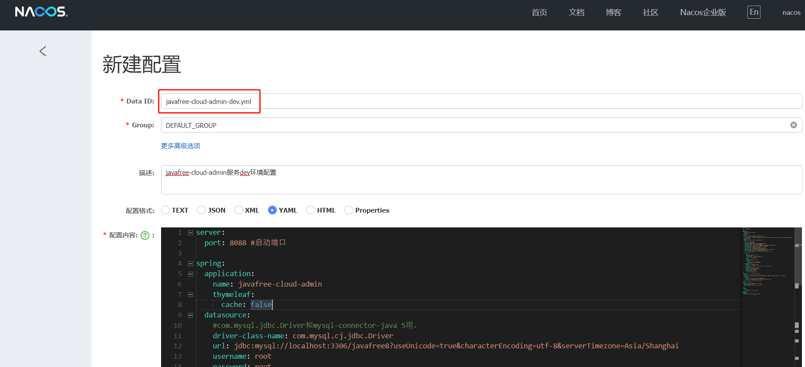

**3. 新建一个名为javafree-cloud-admin-test.yml配置存放测试环境配置**

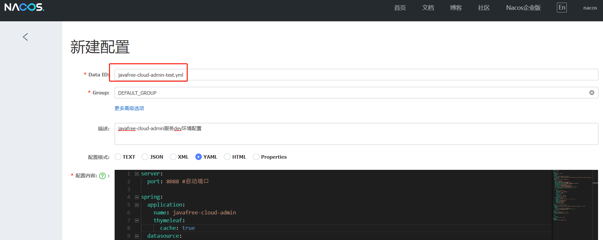

 **4. 接下来，修改bootstrap.yml中的配置，将active设置成test，再次访问，观察结果**

```
spring:
  application:
    name: javafree-cloud-admin
  cloud:
    nacos:
      config:
        server-addr: 127.0.0.1:8848 #nacos中心地址
        file-extension: yml # 配置文件格式 
  profiles:
    active: test
```

#### B. 不同微服务之间的共享配置

​		不同服务之间实现配置共享的原理类似于文件引入，就是定义一个公共配置，然后在当前配置中引 入。 

**1. 在nacos中定义一个DataID为all-service.yaml的配置，用于所有微服务共享**

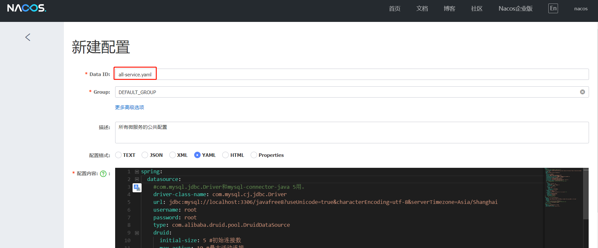

**2. 在nacos中信息其他服务yaml的配置，去除公共配置内容**

**3. 修改代码工程中bootstrap.yml 配置**

> 注意：shared-dataids， refreshable-dataids目前已经被标为@Deprecated

```
spring:
  application:
    name: javafree-cloud-admin
  cloud:

    nacos:
      config:
        server-addr: 127.0.0.1:8848 #nacos中心地址
        file-extension: yml # 配置文件格式 
        shared-dataids: all-service.yaml # 配置要引入的配置
        refreshable-dataids: all-service.yaml # 配置要实现动态配置刷新的配置
  profiles:
    active: dev  
```


## 3、Nacos 服务注册中心

​		下面示例介绍，以Nacos作为我们微服务的服务注册中心系统，并将我们的微服务注册到nacos服务上

### 3.1 添加nacos的依赖

​	在pom.xml中添加nacos的依赖

```
<dependency>
     <groupId>com.alibaba.cloud</groupId>
     <artifactId>spring-cloud-starter-alibaba-nacos-discovery</artifactId>
</dependency>
```


### 3.2 主类上添加注解

​		在微服务的启动主类上，通过 Spring Cloud 原生注解 `@EnableDiscoveryClient` 开启服务注册发现功能.

> 注：如果不添加@EnableDiscoveryClient ，微服务注册功能不生效

```
import lombok.extern.slf4j.Slf4j;
import org.springframework.boot.SpringApplication;
import org.springframework.boot.autoconfigure.SpringBootApplication;
import org.springframework.cloud.client.discovery.EnableDiscoveryClient;
import org.springframework.context.ConfigurableApplicationContext;
import org.springframework.core.env.Environment;
import springfox.documentation.oas.annotations.EnableOpenApi;

import java.net.InetAddress;
import java.net.UnknownHostException;

@Slf4j
@EnableOpenApi
//加包的扫描范围，默认有些bean无法加载,解决GlobalExceptionHandler不生效问题
@SpringBootApplication(scanBasePackages = {"com.javafree.cloud", "com.javafree.cloud.common"})
@EnableDiscoveryClient   //开启服务注册发现功能
public class JavafreeAdminApplication {

    public static void main(String[] args) throws UnknownHostException {
        ConfigurableApplicationContext application = SpringApplication.run(JavafreeAdminApplication.class, args);

        Environment env = application.getEnvironment();
        String ip = InetAddress.getLocalHost().getHostAddress();
        String port = env.getProperty("server.port");
        String path = env.getProperty("server.servlet.context-path");
        port=port==null?"":port;
        path=path==null?"":path;
        log.info("\n----------------------------------------------------------\n\t" +
                "Application Javafree-admin is running! Access URLs:\n\t" +
                "Local: \t\thttp://localhost:" + port + path + "/\n\t" +
                "External: \thttp://" + ip + ":" + port + path + "/\n" +
                "----------------------------------------------------------");
    }
}
```

### 3.3 修改配置文件

 		在微服务的代码工程配置文件(bootstrap.yml，application.yml等)，或通过已经采用的配置中心中添加nacos服务的地址。

```
spring:
  cloud:
    nacos:
      discovery:
        server-addr: 127.0.0.1:8848
```

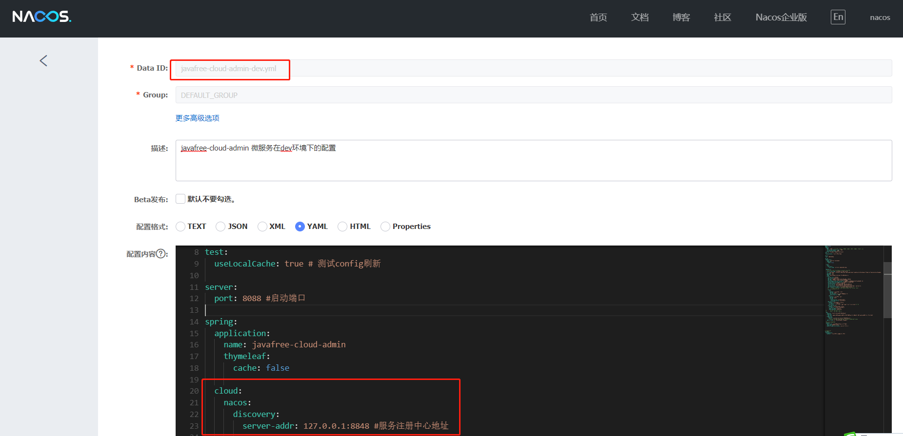


### 3.4 启动服务

​		启动服务， 观察nacos的控制面板中是否有注册上来的微服务

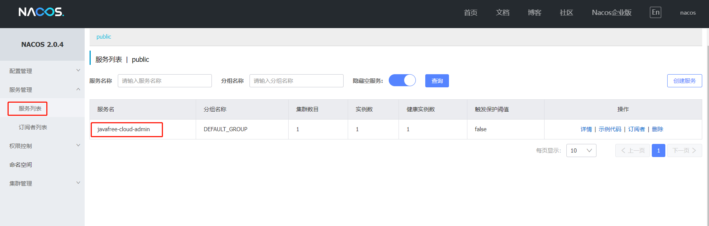

  

